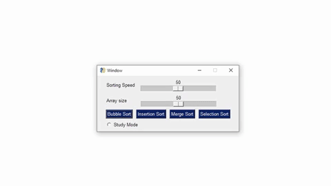

# Sorting Algorithm Visualizer

This project was done to accomplish two things:
1. Learn Python
2. Refresh my knowledge on sorting algorithms

This app 'visualizes' sorting algorithms by representing the array as a bar graph. It makes the sort easier to follow by highlighting the important elements, and providing captions at each step.

### Prerequisites

Please ensure you have Python 3+ installed (https://www.python.org/downloads/).


### Installation

1. First, download this project by using the green button, "Clone or download" at the top-right portion of the page.

2. From the terminal, navigate to this project's directory. 

3. Use the following command to install this project's dependencies:
```
pip install -r requirements.txt
```

### Running the program

Run the script by using:
```
python app.py
```



Alternatively, you can double-click the executable found in the dist folder.


## Author

* **Chandler Cabrera** 

